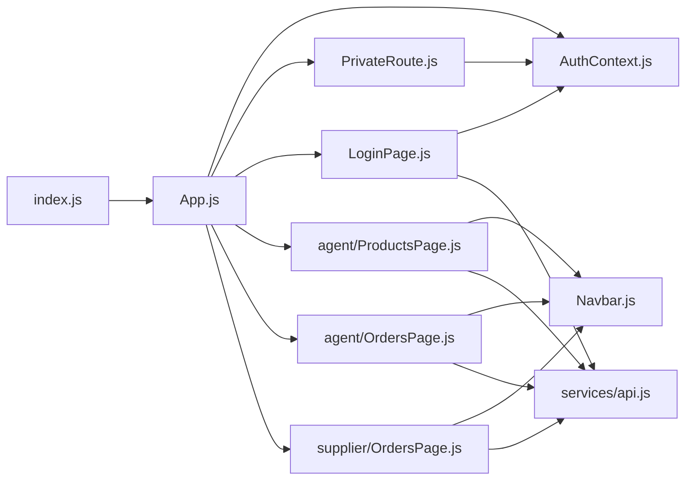
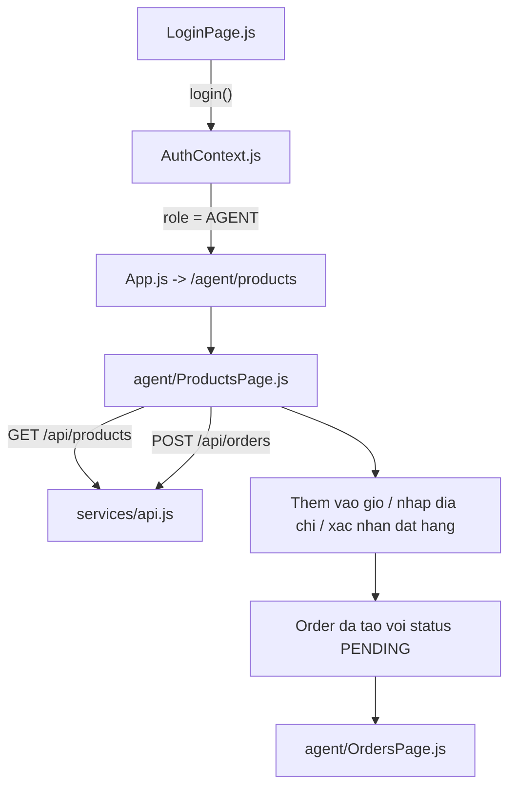
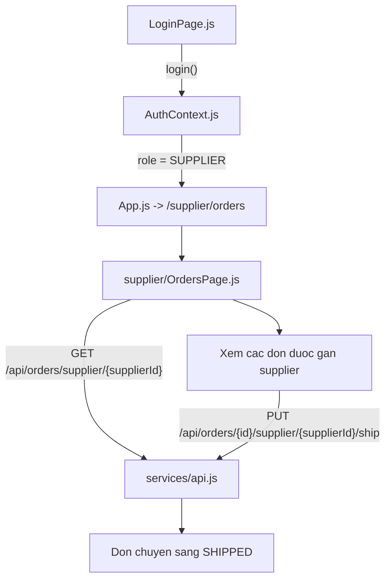
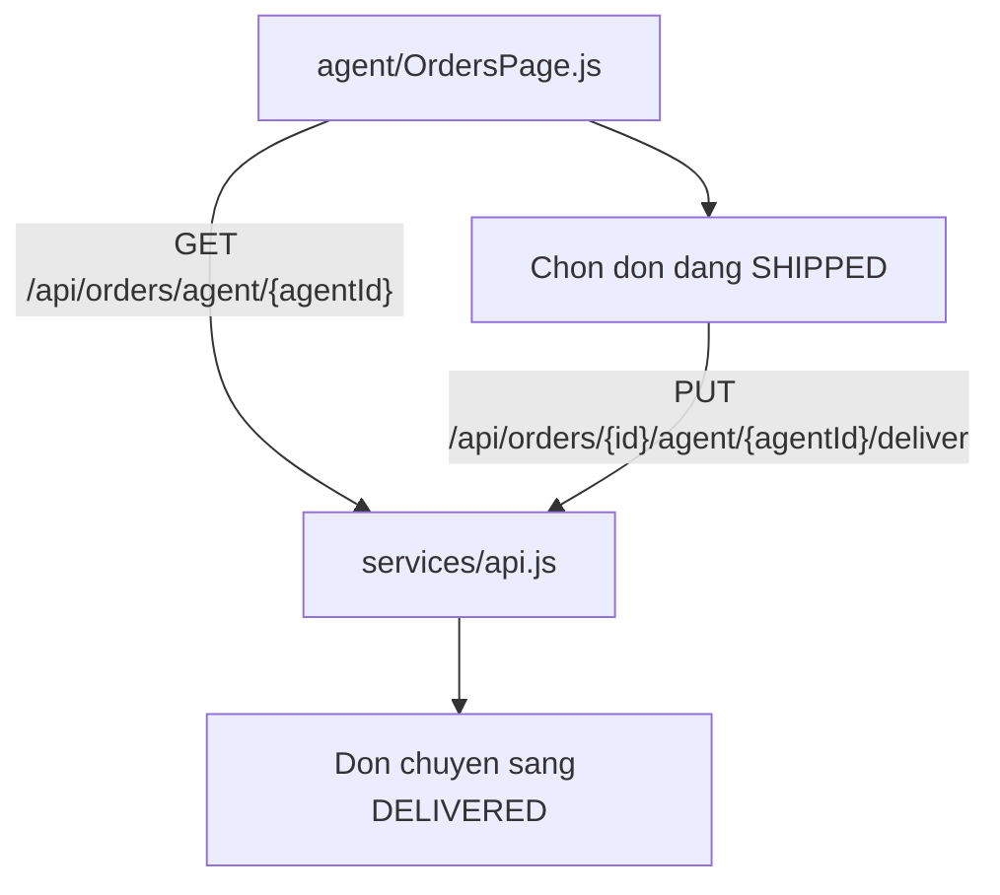

# Frontend Flow

## 1. So do cac file frontend

## 2. Luong dai ly con dat hang online

## 3. Luong supplier giao xuat hang

## 4. Luong dai ly con xac nhan da nhan hang

## 5. Vai tro tung file

| File | Vai tro |
|---|---|
| `frontend/src/App.js` | Khai bao route, gioi han man hinh theo role |
| `frontend/src/context/AuthContext.js` | Luu user, token, role, agentId, supplierId |
| `frontend/src/components/PrivateRoute.js` | Chan truy cap sai role |
| `frontend/src/components/Navbar.js` | Hien menu dung theo role AGENT/SUPPLIER |
| `frontend/src/pages/LoginPage.js` | Dang nhap va dieu huong vao flow dung |
| `frontend/src/pages/agent/ProductsPage.js` | Catalogue + gio hang + tao don online |
| `frontend/src/pages/agent/OrdersPage.js` | Xem don va xac nhan DELIVERED |
| `frontend/src/pages/supplier/OrdersPage.js` | Xem don duoc gan va cap nhat SHIPPED |
| `frontend/src/services/api.js` | Axios client, gan JWT vao request |
